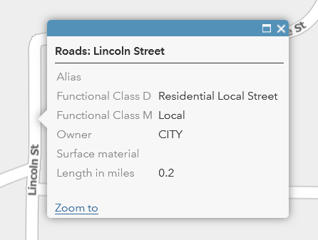

# basemap

Tools that help build and publish the Clatsop County base layers and maps.

2022-09-15 Currently used with ArcGIS Pro 2.9.4 and ArcGIS Enterprise 10.9.1

This started out to be an actual Esri "basemap", but it is not possible to overlay a "basemap" on top of an aerial photo. An Esri map can have only one "basemap" at a time. 

I still refer to it as "the basemap" but it's actually a group of services including label layers and vector layers and a Roads MIL for querying. 

Since every Esri map requires a basemap (it defines the projection),
this project also creates an "Empty basemap", which is a real basemap with a projection, but has no data in it! (The Esri grey map and set it to be 100% transparent still causes data transfers even though it's invisible.)

Raster tiles are bulky and slow and take a long time to build, vector
tiles are fast and small but Esri won't let you query them,
so the project uses a Roads layer for queries.

In summary, we have these components now:

1. Vector Labels - the labels only, and a county boundary line, for web maps.
2. Taxlot Address Labels -
3. Taxlot Labels - 
4. Roads map containing two feature layers
5. Vector Tiles - everything, useful offline for example in Field Maps.
6. Unlabelled Tiles - feature layers without any labels, for web maps
7. "Empty basemap" (that's its name.)

| labels | features | labels and features | vector + raster |
|--------|----------|---------------------|-----------------|
|  |  |  |  |

Here is some advice on [how to author not-awful vector maps](https://pro.arcgis.com/en/pro-app/latest/help/mapping/map-authoring/author-a-map-for-vector-tile-creation.htm).

The vector datasets also help a lot with Field Maps. They helped with Collector too. (R.I.P.)
In Field Maps, every map has to have a "real basemap" but I don't want to incur massive downloads and to require a live connection to the Internet.

## Prerequisites

First time around,clone the standard Python environment then add things to it. If you upgrade Pro then you can upgrade the environment
but it's probably faster to nuke it and start over.

```bash
conda env remove --name arcgispro29
conda create --clone /c/Program\ Files/ArcGIS/Pro/bin/Python/envs/arcgispro-py3 --name arcgispro29
conda activate arcgispro29
conda install autopep8
proswap arcgispro29
```

## Regarding the layer order problem in the Esri web map viewer

Esri places arbitrary restrictions on the order of services in their maps. This is true in "Map Viewer Classic". I have not tested the new Map Viewer yet.

1. Basemaps can only go at the bottom. The reference layer associated with a basemap (normally containing the labels) goes near the top somewhere.
2. Vector tile layers and Map Image Layers (MIL) can go in the middle in any order.
3. Feature services have to go at the top.

This means if you use lots of feature layers, they will stack up on top of your MIL and Vector layers.
If you are using Vector Tiles as labels, this is bad because it means your Feature layers will cover over the labels.
For us, in practice it's not so bad because very few feature layers are used in our maps. We mostly use MILs right now. 

**If you absolutely must have lots of Feature Layers and can't use MILs instead, this could be a problem preventing you from using labels in a Vector Tile layer**

## Collector notes (also Field Maps?)

___Once you get the vector tile package built and published, you won't want to use the service in Collector.___

You _have_ to sideload the tile package so that you can use it offline. Otherwise it will still be
an ONLINE map, just one that uses less cellular data (assuming you have a connection) for field work.
Much of our county does not have cellular data connectivity.

Here are
[Esri instructions on how to sideload](https://www.esri.com/arcgis-blog/products/collector/field-mobility/speed-up-offline-collector-deployments-using-sideloaded-basemaps/)

I still wanted to avoid the issue of sideloading when online work is okay, so I also built a raster tile map. The tricks here include
(1) __YOUR MAP MUST HAVE AN EDITABLE LAYER__ This means there is no hope to author a map and let people use it just for navigation. Forget Collector for that.
(2) Everything has to be shared correctly and hosted on the server
(3) if you meet all the requirements and you enable offline use then you will be able to download. Otherwise the map shows in Collector and it's not downloadable.
(4) I am pretty sure you have to manage the downloadable areas from the browser to create them in advance. That's the only way I could see them in Collector. I think Field Maps lets you define them on the fly from the device.

Anyway, back to designing a vector map, here is a checklist.

* Use the standard list of scales
* Do not use a reference scale
* Groups are okay; I have "Reference" at the top and "Clatsop_County" at the bottom.
* Use no rasters. (duh)
* Update the metadata (there is a date stamp in there.)
* Read the doc on how to adjust symbols. This is the most important step here.

Best practices

* Use a local copy of the data. Be very careful when updating it in a map, because it will remove all the layers from your map and you will lose your style info POOF! Yes, I am still touchy about this.
* Clean the copy (look for duplicates, dissolve roads, etc)
* Fix geometry errors

## Workflow

### Creating the "Empty" basemap

<https://learn.arcgis.com/en/projects/design-and-publish-basemaps/>

The data for this map never changes.
But after I did an Esri "upgrade" it was broken.

When building the empty basemap,

1. Open the "No basemap" map in the basemap project.
2. Run "Create Vector Tile Index".
3. In properties make sure the extent is set to

```text
    46.4
-124    123
    45.6
```

4. "Share as Web Layer"
5. In "General" tab,

* "Copy all data", "Vector Tile"
* Set the tags to Clatsop County, Vector tiles, Basemap

6. In "Configuration" tab,

* Set to "Cache locally".
* Set scale range from 9 (County) to 20 (Houses)
* Point to the index you created earlier.

## The workflow with these scripts

scripts/        Scripts for building basemaps and publishing them

The scripts use maps in an APRX file, K:\webmaps\basemap\basemap.aprx.

* most settings are in config.py; .env has some secrets in it
* make sure the map it uses does not have any selections
* make sure the data sources are correct, you might want STAGING version for example.

### Republish vector layers, including all the label layers.

In order of usage for a workflow,

    process_data.py     status: working
        Make sure you pull the version you want, typically either from Default or Staging.
        Downloads data from the Enterprise GDB to a local FGDB and reprojects it to Web Mercator.
        Processes copied data; unsplits roads and water lines and removes unwanted attributes.

    stage_services.py   status: working
        Uses basemap.aprx file to 
        process feature classes into vector tile maps 
        and then publishes them on the portal.
        They always get named with timestamps so no existing services are ever injured (aka overwritten).

    release_services.py  status: working
        If a tile service does not exist, create it
        else replace existing vector tile services.
        Controlled by a table near the top of the source file.

    publish_roads.py    status: working (although sometimes randomly can't publish)
        Uses the Roads map in basemap.aprx, uses "share" and overwrite an existing layer.
        This layer is used for queries (popups), which are not currently supported by Esri with vector tiles.

    republish_raster_tiles.py   status: ABANDONED
        This was to be used for republishing raster tiles, just here for cold storage.
        TODO Read the code and update this note!!

### Republish Roads feature layer

1. First run "process_data.py", that will import current data into the local FGDB used here.
2. Open the basemap project, (k:\webmaps\basemap\basemap.aprx) open the Roads map.
3. Use Share->Web Layer->Overwrite Web Layer (destination is in my folder "Public Works")
Read about the [dismal Overwrite popup](https://pro.arcgis.com/en/pro-app/2.9/help/sharing/overview/overwrite-a-web-layer.htm) Seriously, it will be fine if there were no schema changes.
4. Discover it won't let you. Curse the fact that overwrite only works 1/2 the time.
5. Delete Roads and republish it.
6. For each map service in Portal that uses Roads,
   * Open the map in Map Viewer Classic.
   * Add the new Roads feature service.
   * Fix up the query and popup again.
7. Do more work on automating this step again so that you don't have to do this again.

The popup should look like this, it's not fancy. In fact it's generic. I might not even care if it is updated properly each time I have to do an overwrite.  


2022-03-16 I noticed there is now a "queryable" option when publishing
a vector layer, but it threw an error when I tried it.

## Some additional files

    basemap.aprx       ArcGIS Pro project file

    Roads.lyrx         roads feature class from the local GDB, symbolized for a vector tile map

    Roads_labels.lyrx  labels for roads

    scripts/watermark.py   Prints text onto a thumbnail image, not using this right now. Thumbnails are cute but putting text on one is a hack to fix the deficiencies in the Portal UI. I am not using this right now but it's referenced in the other scripts so I am leaving it here. 

    scripts/colors.py   Finds the dominant color in an image, used in watermark.py.

    scripts/portal.py   PortalContent class, sadly forgotten work-in-progress 

```

be645e399add4c4db2bbe36ba754bb30
