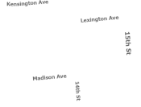
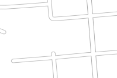
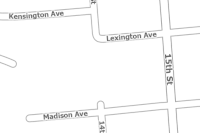
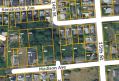

# basemap

A collection of files that help me build and publish the Clatsop County basemap layers and maps.

The "basemap" used in most of our web maps is not a basemap at all, because we wanted
to overlay roads (and other things) on top of different aerials. An Esri map can
have only one "basemap" at a time. 

Once I had that worked out I wanted to have the labels up high in the stack so that
they'd float on top of other services. So this project creates three services.

1. Vector Labels - the labels only, and a county boundary line, for web maps.
2. Vector Tiles - everything, useful in offline Collector and Field Maps applications.
3. Unlabelled Tiles - feature layers without any labels, for web maps

| 1 labels | 2 features | 3 labels and features | vector + raster | 
|----------|------------|-----------------------|-----------------|
|  |  |  |  |

Along the way I had to 
[learn how to author not-awful vector maps](https://pro.arcgis.com/en/pro-app/latest/help/mapping/map-authoring/author-a-map-for-vector-tile-creation.htm).

In Collector, every map has to have a "real basemap" but I don't want to incur massive
downloads and require a live connection to the Internet.
To work around this, I created an empty basemap called "Empty Basemap". 
All it needs to do is define the projection, Web Mercator. I ended up using this in all my web maps too.
(Originally I used the Esri grey map and set it to be 100% transparent. This still causes
data transfers even though it's invisible.)

### Layer order problem

Esri places arbitrary restrictions on the order of services in their maps.

1. Basemaps can only go at the bottom. The reference layer associated with a basemap (normally containing the labels) goes near the top somewhere.
2. Vector tile layers and Map Image Layers (MIL) can go in the middle in any order.
3. Feature services have to go at the top.

This means if you use lots of feature layers, they will stack up on top of your MIL and Vector layers. 
If you are using Vector Tiles as labels, this is bad because it means your Feature layers will be on top of the labels.
For us, in practice it's not so bad because very few feature layers are used in our maps. We mostly use MILs.

** If you absolutely must have lots of Feature Layers and can't use MILs instead, this could be a problem preventing you from using labels in a Vector Tile layer **

## Collector notes

___Once you get the vector tile package built and published, you won't want to use the service in Collector.___

You _have_ to sideload the tile package so that you can use it offline. Otherwise it will still be
an ONLINE map, just one that uses less cellular data (assuming you have a connection) for field work.
Much of our county does not have cellular data connectivity.

Here are 
[Esri instructions on how to sideload](https://www.esri.com/arcgis-blog/products/collector/field-mobility/speed-up-offline-collector-deployments-using-sideloaded-basemaps/)

I still wanted to avoid the issue of sideloading when online work is okay, so I also built a raster tile map. The tricks here include 
(1) __YOUR MAP MUST HAVE AN EDITABLE LAYER__ This means there is no hope to author a map and let people use it just for navigation. Forget Collector for that. 
(2) Everything has to be shared correctly and hosted on the server 
(3) if you meet all the requirements and you enable offline use then you will be able to download. Otherwise the map shows in Collector and it's not downloadable. 
(4) I am pretty sure you have to manage the downloadable areas from the browser to create them in advance. That's the only way I could see them in Collector. I think Field Maps lets you define them on the fly from the device.

Anyway, back to designing a vector map, here is a checklist.

* Use the standard list of scales
* Do not use a reference scale
* Groups are okay; I have "Reference" at the top and "Clatsop_County" at the bottom.
* Use no rasters. (duh)
* Update the metadata (there is a date stamp in there.)
* Read the doc on how to adjust symbols. This is the most important step here.

Best practices

* Use a local copy of the data. Be very careful when updating it in a map, because it will remove all the layers from your map and you will lose your style info POOF! Yes, I am still touchy about this.
* Clean the copy (look for duplicates, dissolve roads, etc)
* Fix geometry errors

## Workflow

scripts/        Scripts for building basemaps and publishing them

In order of usage for a workflow,

    process_data.py     status: working
        Downloads data from the Enterprise GDB to a local FGDB and reprojects it to Web Mercator.
        Processes copied data; unsplits roads and water lines and removes unwanted attributes.

    stage_services.py   status: working
        Uses basemap.aprx file to 
        process feature classes into vector tile maps 
        and then publishes them on the portal.
        They always get named with timestamps so no existing services are ever injured (aka overwritten).

    release_services.py  status: working
        If a tile service does not exist, create it
        else replace existing vector tile services.
        Controlled by a table near the top of the source file.

    publish roads  status: No script yet
        I still publish a Map Image Layer for Roads after doing the above processing. 
        Use the Roads map in basemap.aprx, use "share" and overwrite the existing layer.
        This layer is used for queries (popups), which are not supported by Esri with vector tiles.

    republish_raster_tiles.py   status: ABANDONED
        This was to be used for republishing raster tiles, just here for cold storage.
        TODO Read the code and update this note!!

## Some additional files

    basemap.aprx       ArcGIS Pro project file

    Roads.lyrx         roads feature class from the local GDB, symbolized for a vector tile map

    Roads_labels.lyrx  labels for roads

    scripts/watermark.py   Prints text onto a thumbnail image, not using this right now. Thumbnails are cute but putting text on one is a hack to fix the deficiencies in the Portal UI. I am not using this right now but it's referenced in the other scripts so I am leaving it here. 

    scripts/colors.py   Finds the dominant color in an image, used in watermark.py.

    scripts/portal.py   PortalContent class, sadly forgotten work-in-progress 

